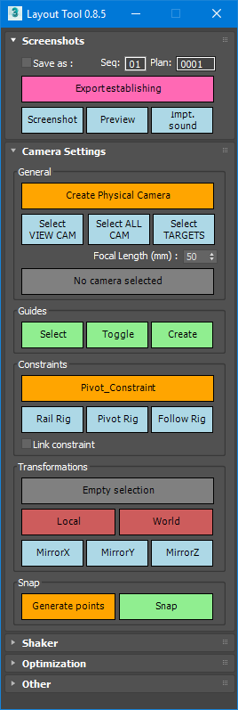

# Layout Tool

Copyright (c) TATProductions.

DESCRIPTION: Tool for Layout department. Allow to setup specification scene, camera, and make previews. 
AUTHOR: Laurent Chea 
MAINTENER: Pierre Lasbignes 
DATE: 2019-2021 

# What is it?

	Layout is a window tool created for 3dsmax 2019-2021.
	It helps layouters to : 
  - apply settings to camera ( focus, lenght, etc...).
  - make shake cam.
  - make preview with options ( lights, guides, etc...).
  ...

# Install & Loading 
	/!\ Warning, this project needs externals TAT libraries that might not be included. 
	
	- copy LayoutTool folder  to [yourCustomPath]
	- the commande "fileIn	[yourCustomPath]\LayoutTool\LayoutTool.ms"  will execute the file. This is the loader of the project
	
# API

  - The main functions are listed in structure ST_layoutTool ( LayoutTool_lib.ms file ).
  - To access methods, use LayoutTool global var. 
  - LayoutTool = ST_layoutTool()

# LayoutToolSync

Copyright (c) TATProductions.

DESCRIPTION: Tool for Layout department. Allow to syncronize local / network layouters's datas. 
AUTHOR: Pierre Lasbignes 
DATE: 2021 

# What is it?

  It's a python script that can be executer within or without 3dsmax. It compare datas between local Layouter and network too maintain the most recent datas.
  To do this, the script make severals operations:
  - group files by checking sceneName , variationName (A,B,C) and versionName (.v001) , accessible in fileName.
  - copy the most recent version
  - backup old version
  - finally, if no versionis detected or two files have the same version, copy the most recent file by date.
  
# Install & Loading 

- Within 3dsmax, it will be loaded with LayoutTool.
- the commande "fileIn	[yourCustomPath]\LayoutTool\LayoutTool.ms"  will execute the file. This is the loader of the project

- Wihout 3dsmax, you can execute TatSyncbatch.py with VSCode for example. 
